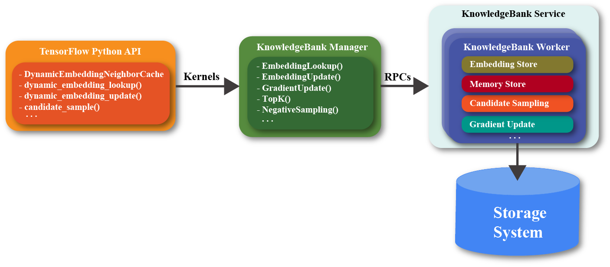

# CARLS: Cross-platform Asynchronous Representation Learning System

## Components Overview

*   TensorFlow API: Python functions that are implemented by C++ ops.
*   KnowledgeBank Service (KBS): a gRPC server that implements embedding
    lookup/update.
*   KnowledgeBank Manager: client side C++ hub that talks to KBS.
*   Storage System: underlying storage for Knowledge Bank, e.g.,
    InProtoKnowledgeBank for in-memory storage.



## An End-to-End Example

Below are the intructions to run the example under
[examples/graph_keras_mlp_cora.py](examples/graph_keras_mlp_cora.py) by building
from source.

### Prerequisite

*   Create a virtual environment (optional) and install TensorFlow by following
    the
    [instructions](https://www.tensorflow.org/install/pip#2.-create-a-virtual-environment-recommended).

*   Follow the instructions from
    [tensorflow.org](https://www.tensorflow.org/install/source#install_bazel) to
    install Bazel.

*   Install additional packages

    ```sh
    $ pip3 install -r neural_structured_learning/requirements.txt
    ```

*   Install neural-structured-learning

    ```sh
    $ pip3 install neural-structured-learning
    ```

### Step One: Download the Neural Structured Leaning source code.

```sh
$ git clone https://github.com/tensorflow/neural-structured-learning.git
$ cd neural-structured-learning
```

### Step Two: Download the data to /tmp/cora.

```sh
$ bash neural_structured_learning/examples/preprocess/cora/prep_data.sh
```

### Step Three: Run the example

```sh
$ bazel run research/carls/examples:graph_keras_mlp_cora -- \
/tmp/cora/train_merged_examples.tfr /tmp/cora/test_examples.tfr \
--alsologtostderr --output_dir=/tmp/carls
```
